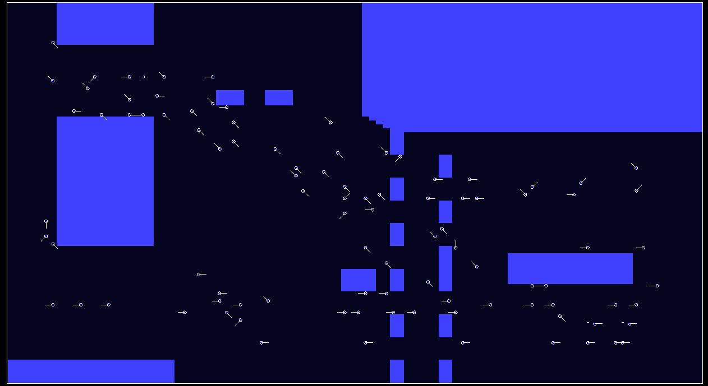

# CrowdMovmentSimulation
  Simple real-time agent-based simulation of crowd movement.
  
  
 ## Implemented models:
  * Discrete preprocessed shortest path agent movement
  * Discrete gradient based agent movement

## What do you need?
  * System supporting OpenGL (Almost any nowadays)
  * Python interpreter 

## Getting Started
  1. Clone repository to your machine 
  
     git clone repository_url
  
  2. Install required python packages
  
      pip install -r requirements.txt
  
  3. You should be ready to go now! run gradient_main.py from project root (Linux)
  
     ./gradient_main.py
  
          
## Project Goal
  The goal of the project was to showcase and test different methods of crowd simulation. We wanted to implement few different methods, compare one to another and at the end compare them with real-world crowd behavior. 

## Result
  * Now there are two different discrete simulation methods implemented, presenting a different approach to the subject.
  * Both methods are really quick. 
  * Gradient-based model gave much more believable results as far as the agent behavior goes. 
  * Worth noting is model parameters have a huge impact on simulation results.

## Future
  **The project is in constant development.**
  We plan to:
  * Do more testing with different parameters
  * Improve the presentation aspects
  * Optimize simulations and visualization speed
  * Add GUI with tools for easier testing
  * Add map creator
  * Add different simulation models (We are especially interested in adding a continuous model)
  
## New map generating
  If you want to generate your own map do it by using model.environment.environment.direction_map function.
  Our example can be found in resources.create_map_100x100. (For map greater than 100x100 it takes a while, so don't worry, it works)
  
### Built Using
  * PyOpenGL
  * NumPy
  * glfw
